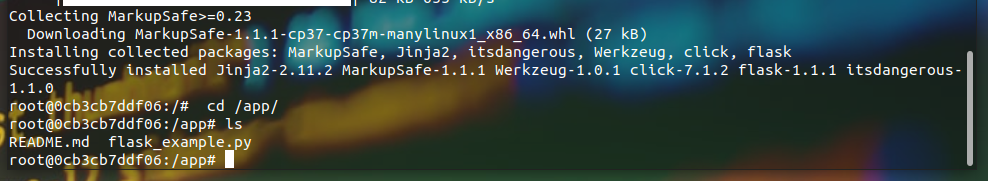

<H4> Launching a Python Flask runtime container</H4>

Go in the required folder (in my case here, the one containing ```flask_example.py```):

```docker run -it --name myflask1 -p 5000:5000 -v ${PWD}:/app python:3.7 bash```

<ul>
<li><code>docker run</code> simply start a new container </br>
<li><code>-it</code> allows for an interactive container with output in terminal window </br>
<li><code>-p 5000:5000</code> defines the port mapping. Every container has it own network stack, own IP address, etc... Flask waits for http requests at this defined port (5000). 5000 on the left is Host Port, 5000 on the right side of the column is the container port. Thanks to this mapping we can access the container with <code>localhost:5000</code> url
<li><code>-v ${PWD}:/app </code>This option mapps current working directory on development machine denoted by <code>PWD</code> variable to <code>/app</code> directory in the container. This way, the container is going to have access to all filles and sub-folders of basic env folder. Programs run in the container can read and write to <code>/app</code> directory. This way they acces basic env.This is called <strong>bind mounting</strong>.
<li><code>python:3.7</code> is a name of python container image stored at docker-hub. It is called an "official python image".
<li><code>bash</code> launches a linux shell.
</ul>

</br>
We see indeed that we've got the contents of the sub-folder where we were located at when we created the container thourgh the complete command above:



<code>export FLASK_APP=flask_example.py </code></br>
<code>export FLASK_DEBUG=1 </code></br>
<code>flask run --host=0.0.0.0</code> </br>
</code>

Now go on <code>localhost:5000</code> or <code>0.0.0.0:5000</code></br>
try also <code>localhost:5000/version</code>


The same with our Django project, but on port 8000: </br>
```docker run -it --name mydjango1 -p 8000:8000 -v ${PWD}:/app python:3.7 bash```
</br>
<code>docker run -it --name jupyter-data1 \ </code></br>
<code>-p 8888:8888 \ </code></br>
<code>-v ${PWD}:/home/jovyan/work \</code></br>
<code>-e JUPYTER_ENABLE_LAB-yes \</code></br>
<code>jupyter/datascience-notebook</code></br>
</br>
<code>docker start -ia jupyter-data1</code> </br>
<code>docker rm jupyter-data1</code>
